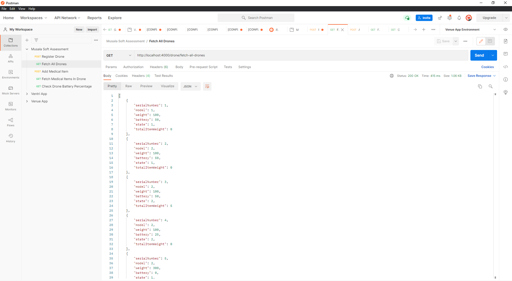

# Drone API
Drone API to simulate effective use of medical drones in real world scenerios, an assesment based project built with C# and the .NET framework.

## Details:
### Service Features Implemented:
* Registering a drone
* Loading a drone with medication items
* Checking loaded medication items for a given drone
* Checking available drones for loading
* Check drone battery level for a given drone

### Functional Features Implemented:
* Prevent the drone from being loaded with more weight that it can carry
* Prevent the drone from being in LOADING state if the battery level is **below 25%**;
* Introduce a periodic task to check drones battery levels and create history/audit event log for this.

## Getting Started
These instructions will get you a copy of the project up and running on your local machine for development and testing purposes.

### Prerequisites
The basic requirements for building the executable are:
* Visual Studio 2019 or higher with all C# .NET tools
* Post-man (To test the API's launched on local host port 4000)

### Building project with visual studio
This program has been tested on Windows 10 and binaries built with visual studio 2019. but should work under any system that fulfils the aforementioned requirements.

#### Building Project Solution Files
Click on the file with the .sln extention in the main project directory and should open in visual studio. hit F5 to build and run or hit the green play button on the tool bars at the top.
console window should open and the live server should begin to run on port 4000, with SQl lite database automatically set-up already on startup.
now locate the ```PostManTest-Collection/``` directory in the main poject directory and find the file ```MusalaSoftAssessment.postman_collection.json``` import it into post-man and begin to fire the 
end points to test the program currently running on your local-host

Some screenshots along the way of developing and Testing on Postman (Fetched data from list of drones):


## Author
* **Alexander Ibeh** - [harlexkhal](https://github.com/harlexkhal)